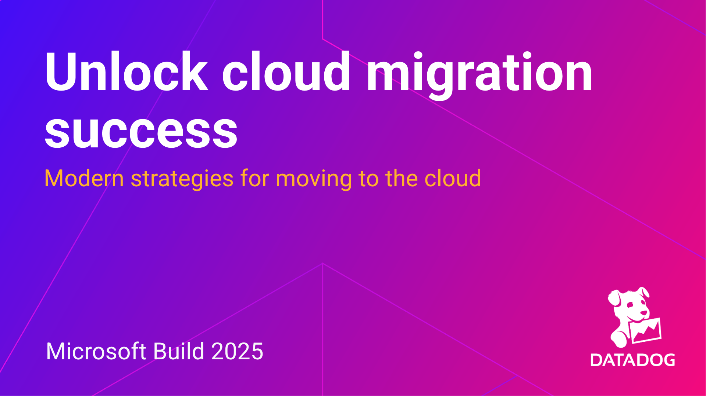

# Unlock Cloud Migration Success

Welcome! This page contains all the key resources referenced in the **"Unlock Cloud Migration Success"** presentation from **Microsoft Build 2025**. Whether you're planning your first move to the cloud or optimizing an ongoing migration, these resources are here to help you navigate the process with clarity and confidence.

## 📑 Presentation Slides

- 📂 [Download the presentation slides (PDF)](slides/MS Build 2025 - Unlock Cloud Migration Success.pdf)

## 🔧 Key Resources

Explore tools, best practices, and implementation guides to support each phase of your migration journey:

- 🛠️ **Plan with Confidence**  
  [Migrate to Azure with the Microsoft Cloud Adoption Framework](https://www.datadoghq.com/blog/migrate-to-azure-with-the-microsoft-cloud-adoption-framework)

- 📚 **Get Hands-On Guidance**  
  [Azure Cloud Adoption Framework Integration Guide](https://docs.datadoghq.com/integrations/guide/azure-cloud-adoption-framework)

- 📘 **Strategy & Planning**  
  [Cloud Excellence: The Azure Migration eBook](https://www.datadoghq.com/resources/cloud-excellence-azure-migration-ebook)

- 🎯 **Define Success Metrics**  
  [Establishing Service Level Objectives (SLOs)](https://www.datadoghq.com/blog/establishing-service-level-objectives)

- 📊 **Monitor What Matters**  
  [Cloud Migration Monitoring Tips](https://www.datadoghq.com/blog/cloud-migration-monitoring)

- 🌐 **Full Solution Overview**  
  [Datadog Cloud Migration Solution Hub](https://www.datadoghq.com/solutions/cloud-migration)
